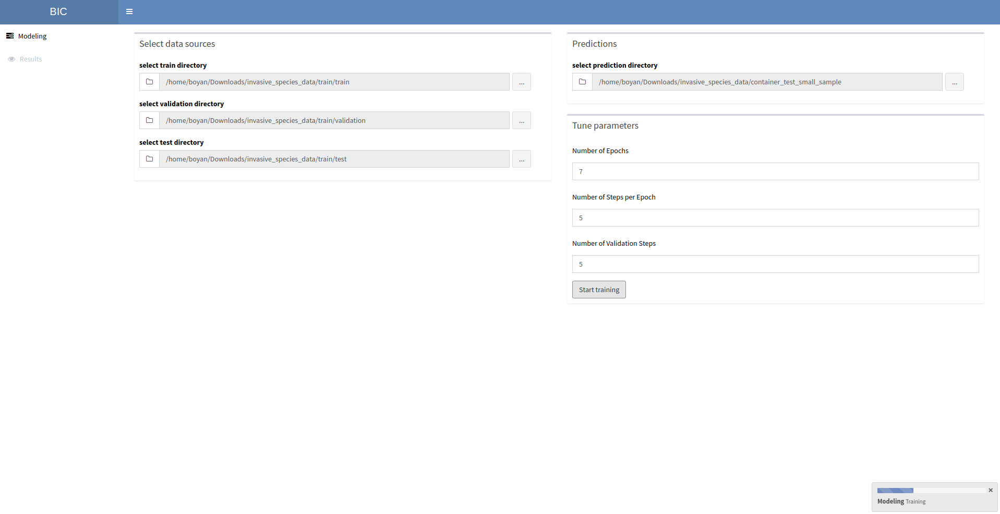
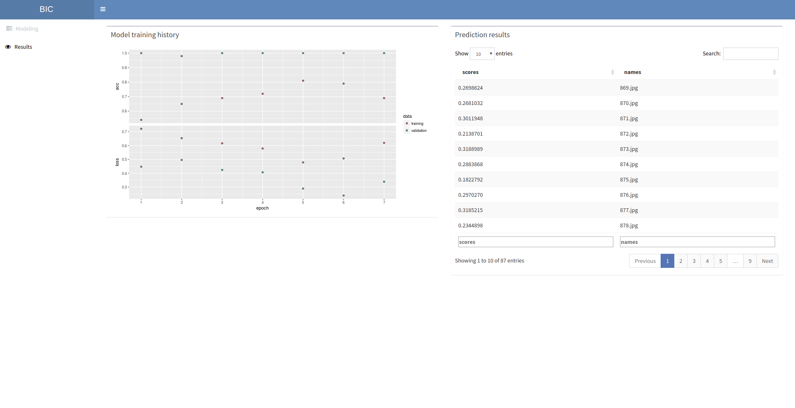

## Image Classifier

For image classification tasks you can use the BIC. It uses the pre-trained convnet (VGG16) along with user provided data to do image classification. If you want to test this and have no data available, you can try the Kaggle Cats and Dogs image classification competition [here](https://www.kaggle.com/c/dogs-vs-cats/data. If you are interested in the machine learning behind this process here is a great tutorial from RStudio - https://tensorflow.rstudio.com/blog/keras-image-classification-on-small-datasets.html), based on the [Deep Learning with R](https://www.manning.com/books/deep-learning-with-r) book.

Training                   |  Results
:-------------------------:|:-------------------------:
 |  |  

## Installation

Before you can use the application there are several installation steps. You will have to install the R keras wrapper (which in turn would also install TensorFlow), and then download the VGG16 model itself.

```r
# install the keras R wrapper
install.packages('devtools')
devtools::install_github("rstudio/keras")

# load library
library(keras)

# install tensorflow backend
install_keras()

# download VGG16
conv_base <- application_vgg16(
        weights = "imagenet",
        include_top = FALSE,
        input_shape = c(150, 150, 3)
      )
```

After those steps you can go to the classifier directory and run the app.

```bash
cd app_image_rec/app
```

## Data folder structure

You will need to organize your `training` data in the following way:

* train_folder
  * class_1 folder
    * image_1.png
    * image_2.png
    * ...
    * image_n.png
  * class_2 folder
    * image_1.png
    * image_2.png
    * ...
    * image_n.png

Same for the `validation` and `test` datasets. For the dataset which you want to predict:

* container_folder
  * prediction_folder
    * image_1.png
    * image_2.png
    * ...
    * image_n.png

After selecting your folders, choose your hyperparameters and click `start training` button. The progress indicator will show you when the process is done (deep learning takes time, so be prepared to wait). Once finished you can inspect the results from the `Results` tab.

Thanks to [W. Lee Pang ()](https://github.com/wleepang) for building the [folder path selection functionality](https://github.com/wleepang/shiny-directory-input) for Shiny!
